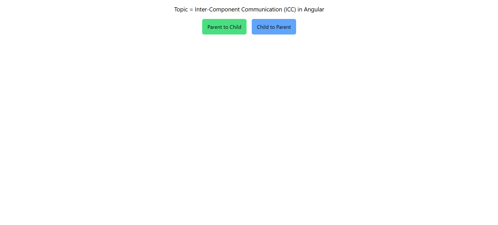
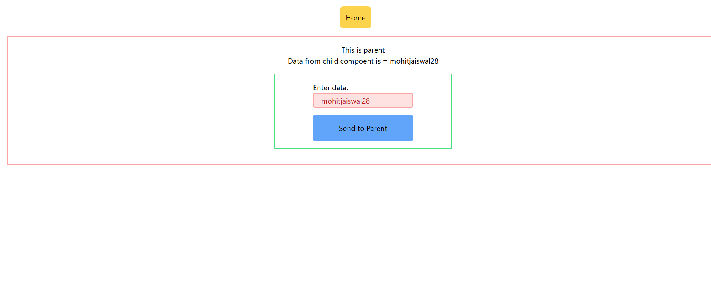

# Inter-Component Communication (ICC) 🌐

## Introduction 📚

Inter-Component Communication (ICC) is a crucial aspect of building robust and modular applications in Angular.

## Table of Contents 📑

1. What is ICC? 🤔
2. Why is ICC important? 🏆
3. Different methods of ICC 🔄

## What is ICC? 🤔

ICC refers to the communication between different components in an Angular application. It allows components to exchange data, trigger actions, and maintain synchronization.

## Why is ICC important? 🏆

ICC enables loose coupling between components, making them more reusable and maintainable. It also promotes separation of concerns and enhances the overall modularity of your application.

## Different methods of ICC 🔄

There are several methods of implementing ICC in Angular, including:

- Parent-to-child communication using `@Input` decorator and `Custom property binding` 📥
- Child-to-parent communication using `@Output` decorator and `event emitters` 📤
- Sharing data through a service 🔗
- Using `@ViewChild` and `@ContentChild` decorators for component interaction 👀

## Demo ⭐





# How to Clone and Run this Project 🖥️

1. Clone the repository:
```
git clone <repository-url>
```

2. Navigate to the project directory:
```
cd <project-directory>
```

3. Install the dependencies:
```
npm install
```

4. Run the application:
```
ng serve
```
